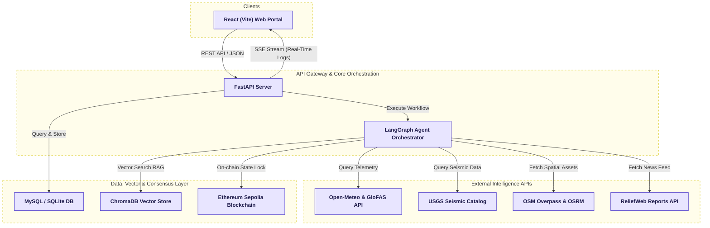

# AapdaSetu AI — Disaster Intelligence Platform

**AapdaSetu** is an autonomous multi-agent AI & Blockchain platform for real-time natural disaster intelligence, rapid resource deployment, and transparent relief coordination.

---

## Key Features
* **Multi-Agent Orchestration:** Powered by **LangGraph** (Gemini/Groq LLaMA) for automated intent geocoding, meteorological analysis, resource matching, and safety reports.
* **On-Chain Audit Trail:** Registers disaster logs and signs budget approvals directly to the **Ethereum Sepolia Testnet** using Solidity smart contracts.
* **Local RAG Advisory:** Ingests official NDMA guidelines into a local vector database to generate safe emergency advisories.
* **Dynamic Portal Dashboards:** Role-based views for Government Approvers, accredited NGOs, and Ground Responders.

---

## System Architecture



AapdaSetu uses a decoupled three-tier architecture:
1. **Interactive Frontend:** Built with React & Vite. Tracks real-time updates through a Server-Sent Events (SSE) stream to provide visual feedback during analysis.
2. **LangGraph Backend:** Built with FastAPI. Orchestrates stateless AI agents, collects environmental data (USGS, Open-Meteo, OpenStreetMap), and serves as the DB/Web3 router.
3. **Consensus Layer:** Solidity smart contract deployed on the Sepolia Testnet, securing disaster logs, budget limits, and approval states.

---

## Multi-Agent Workflow
Every telemetry alert or query triggers the following sequential LangGraph pipeline:
1. **Intent Parser & Geocoder:** Extracts disaster type and maps raw location strings to GPS coordinates via Nominatim.
2. **Disaster Agent (Flood/Earthquake):** Fetches live seismic catalog (USGS) or river discharge forecasts (GloFAS/Open-Meteo) to evaluate environmental severity.
3. **Resource Agent:** Locates nearby hospitals and shelters via OpenStreetMap and calculates safe evacuation routes using OSRM.
4. **RAG Advisory Agent:** Conducts semantic searches over official NDMA/WHO manuals to output localized safety guidelines.
5. **Risk Assessment:** Computes a deterministic risk rating (LOW to EXTREME) based on severity, population exposure, and weather trends.
6. **Mission Planner & Budgeting:** Outputs mission checklists and calculates funding requirements.
7. **Blockchain Oracle:** Signs and commits the disaster audit log to the Sepolia smart contract (exclusive to verified `LIVE` alerts).

---

## Tech Stack
* **Backend:** Python 3.12, FastAPI, LangGraph, SQLAlchemy, Web3.py
* **Frontend:** React 18, Vite, TailwindCSS, Zustand
* **Database & Cache:** Aiven MySQL (prod) / SQLite (dev) + ChromaDB (Vector Search)
* **Blockchain:** Hardhat, Solidity (Sepolia Testnet)

---

## Quick Start (Local Setup)

### 1. Configure Environment
Copy `.env.example` to `.env` in the root directory:
```env
ENV=dev
GEMINI_API_KEY=your_gemini_api_key
GROQ_API_KEY=your_groq_api_key
DATABASE_URL=sqlite:///./aapdasetu.db

# Blockchain Sepolia (Optional, falls back to Mock mode if blank)
WEB3_PROVIDER_URI=https://eth-sepolia.g.alchemy.com/v2/your_alchemy_key
AAPDA_SETU_CONTRACT_ADDRESS=0xF84b71d0395139705E535651dddB2bbdD93a904C
BACKEND_WALLET_PRIVATE_KEY=your_wallet_private_key
```

### 2. Run Backend (Python)
```bash
# Create and activate virtual environment
python -m venv .venv
source .venv/bin/activate  # Windows: .venv\Scripts\activate

# Install dependencies and build RAG vector index
pip install -r requirements.txt
python scripts/preprocess.py

# Start FastAPI server
python -m uvicorn backend.main:app --port 8000 --reload
```
* Interactive API docs: **http://127.0.0.1:8000/docs**

### 3. Run Frontend (React)
```bash
cd frontend
npm install
npm run dev
```
* App URL: **http://localhost:5173**

---

## Key Commands & Testing
* **Run CLI Agent Demo:** `python scripts/demo.py`
* **Run Python Tests:** `python -m pytest`
* **Compile Contracts:** `cd blockchain && npx hardhat compile`
* **Run Contract Tests:** `cd blockchain && npx hardhat test`

---

## Smart Contract Details (Sepolia)
* **Contract Address:** `0xF84b71d0395139705E535651dddB2bbdD93a904C`
* **On-Chain Functions:** `storeDisaster`, `approveRecommendation`, `releaseFunds`, `getDisaster`
