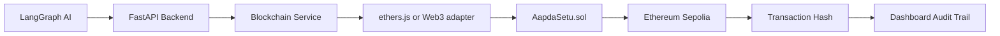
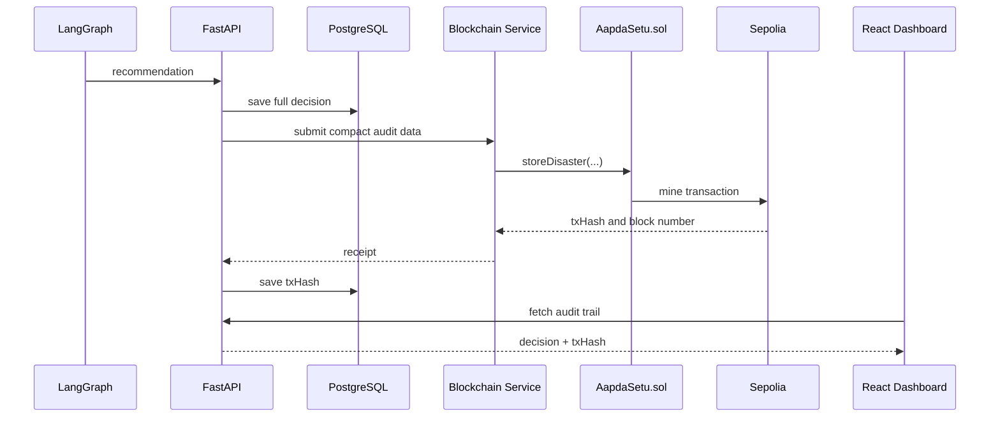
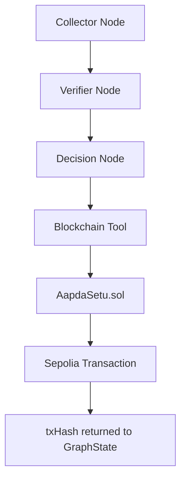

# AapdaSetu AI Blockchain Architecture

## Purpose

AapdaSetu uses Ethereum Sepolia as an immutable audit layer. The blockchain records compact proofs of AI disaster recommendations and government decisions. It does not run AI, store images, create a cryptocurrency, issue NFTs, or move real money.

## Architecture



## Final Folder Structure

```text
blockchain/
  contracts/
    AapdaSetu.sol
  scripts/
    deploy.js
    export-abi.js
  test/
    AapdaSetu.test.js
  abi/
    AapdaSetu.json
  deployments/
    sepolia.json
    localhost.json
  docs/
    BLOCKCHAIN_ARCHITECTURE.md
  artifacts/
  cache/
  hardhat.config.js
  package.json
  .env.example
  README.md
```

| Path | Purpose |
| --- | --- |
| `contracts/` | Solidity smart contracts. |
| `contracts/AapdaSetu.sol` | Main audit contract for disaster recommendations and approvals. |
| `scripts/` | Hardhat automation scripts. |
| `scripts/deploy.js` | Deploys the contract and saves contract address metadata. |
| `scripts/export-abi.js` | Exports ABI for backend and frontend integration. |
| `test/` | Smart contract unit tests. |
| `abi/` | Generated ABI JSON consumed by application services. |
| `deployments/` | Generated contract address files for each network. |
| `artifacts/` | Generated Hardhat build output. |
| `cache/` | Generated Hardhat compiler cache. |
| `hardhat.config.js` | Solidity compiler, Sepolia network, and Etherscan config. |
| `.env.example` | Environment variable template. |

## Smart Contract Architecture

`AapdaSetu.sol` stores each AI recommendation as a `DisasterRecommendation`. Each status change is appended to `HistoryEntry[]`, creating a public audit timeline.

### State Variables

| Variable | Purpose |
| --- | --- |
| `owner` | Admin wallet that deploys the contract and submits AI records. |
| `governmentApprovers` | Wallet allowlist for approval/rejection/release actions. |
| `disasters` | Lookup table from disaster ID to the current record. |
| `disasterHistory` | Timeline of all status changes per disaster. |
| `disasterIds` | Index of all stored disaster IDs. |

### Enums

```solidity
enum DisasterStatus {
    PENDING,
    APPROVED,
    REJECTED,
    RELEASED
}
```

### Structs

`DisasterRecommendation` stores the compact on-chain record:

| Field | Meaning |
| --- | --- |
| `disasterId` | External ID generated by backend. |
| `location` | Disaster location for human audit. |
| `severity` | AI severity score from 1 to 5. |
| `confidenceScore` | AI confidence score from 0 to 100. |
| `recommendedAmount` | Recommended relief amount for audit only. |
| `status` | Current lifecycle status. |
| `aiDecisionHash` | Hash of the full off-chain AI decision. |
| `metadataURI` | Optional pointer to IPFS/backend metadata. |
| `submittedBy` | Wallet that submitted the recommendation. |
| `approvedBy` | Wallet that approved or rejected. |
| `createdAt` | Block timestamp when created. |
| `updatedAt` | Block timestamp when last updated. |

`HistoryEntry` records each transition:

| Field | Meaning |
| --- | --- |
| `status` | Status after the transition. |
| `note` | Short audit note or rejection reason. |
| `actor` | Wallet that caused the transition. |
| `timestamp` | Block timestamp. |

## Contract Functions

| Function | Caller | Inputs | Output | Events |
| --- | --- | --- | --- | --- |
| `storeDisaster` | Owner/backend wallet | ID, location, severity, confidence, amount, decision hash, metadata URI | None | `DisasterStored` |
| `approveRecommendation` | Government approver | ID, note | None | `RecommendationApproved`, `StatusUpdated` |
| `rejectRecommendation` | Government approver | ID, reason | None | `RecommendationRejected`, `StatusUpdated` |
| `releaseFunds` | Government approver | ID, note | None | `FundsMarkedReleased`, `StatusUpdated` |
| `updateStatus` | Government approver | ID, status, note | None | `StatusUpdated` |
| `getDisaster` | Anyone | ID | `DisasterRecommendation` | None |
| `getHistory` | Anyone | ID | `HistoryEntry[]` | None |
| `getAllDisasterIds` | Anyone | None | `string[]` | None |
| `getDisasterCount` | Anyone | None | `uint256` | None |
| `addApprover` | Owner | Wallet address | None | `ApproverAdded` |
| `removeApprover` | Owner | Wallet address | None | `ApproverRemoved` |

## Database vs Blockchain

| Data | PostgreSQL | Blockchain | Why |
| --- | --- | --- | --- |
| Full disaster report | Yes | No | Large app data is expensive on-chain. |
| Images and documents | Yes/off-chain storage | No | Files should not be stored on Ethereum. |
| AI raw reasoning | Yes | Hash only | Store full detail off-chain and proof on-chain. |
| Severity | Yes | Yes | Compact audit field. |
| Confidence score | Yes | Yes | Compact audit field. |
| Recommended amount | Yes | Yes | Public accountability. |
| Approval status | Yes | Yes | Needs immutable audit history. |
| Transaction hash | Yes | Produced by chain | Links database record to Ethereum proof. |
| Beneficiary details | Yes | No | Sensitive data should stay off-chain. |

## Transaction Flow



## Backend Integration

FastAPI can talk to the chain through a small blockchain service. If the app uses Node for blockchain operations, that service should use `ethers.js`. If it stays fully Python, use `web3.py`. The contract ABI tells the service which functions exist. The contract address tells it which deployed contract to call. The RPC URL connects it to Sepolia.

Recommended service functions:

```text
connectProvider()
connectSigner()
getContract()
storeRecommendation()
approveRecommendation()
rejectRecommendation()
releaseFunds()
getDisaster()
getHistory()
verifyTransaction()
listenEvents()
```

## ABI, Address, Wallet, And Gas

| Term | Beginner-friendly meaning |
| --- | --- |
| ABI | The JSON menu of callable contract functions and emitted events. |
| Contract address | The deployed location of `AapdaSetu.sol` on Ethereum. |
| Wallet | Account that signs blockchain transactions. |
| Private key | Secret key controlling a wallet. Never commit it. |
| Public address | Shareable wallet identity visible on-chain. |
| RPC URL | Endpoint used to read and submit Ethereum transactions. |
| Gas fee | Network cost for executing a transaction. |
| Transaction hash | Unique proof that a transaction was submitted. |
| Block number | Ethereum block where the transaction was included. |
| Event log | Structured contract output that apps can index. |

## LangGraph Integration



The blockchain becomes a LangGraph tool. The decision node creates a deterministic decision payload, hashes it, and sends compact fields to the blockchain tool. The tool returns a transaction hash and block metadata that become part of the graph state.

## Deployment

1. Copy `.env.example` to `.env`.
2. Add `SEPOLIA_RPC_URL`.
3. Add a funded Sepolia wallet `PRIVATE_KEY`.
4. Run `npm run compile`.
5. Run `npm test`.
6. Run `npm run deploy:sepolia`.
7. Run `npm run export:abi`.
8. Copy `deployments/sepolia.json` contract address into backend config.

## Security

| Concern | Mitigation |
| --- | --- |
| Access control | Owner submits records; approvers approve/reject/release. |
| Input validation | IDs, location, severity, confidence, and decision hash are checked. |
| Reentrancy | No ETH transfer occurs, so the main reentrancy class is avoided. |
| Replay/duplicate claims | Unique `disasterId` prevents duplicate on-chain records. |
| Private keys | Keep keys in `.env` or managed secret storage only. |
| Gas optimization | Store compact fields and hashes, not complete reports. |

## Testing Strategy

The smart contract test suite covers deployment, approver management, recommendation storage, duplicate rejection, input validation, approval, rejection, release, history reads, and disaster ID indexing. Integration tests should later verify that FastAPI can call the deployed contract and persist transaction hashes.
