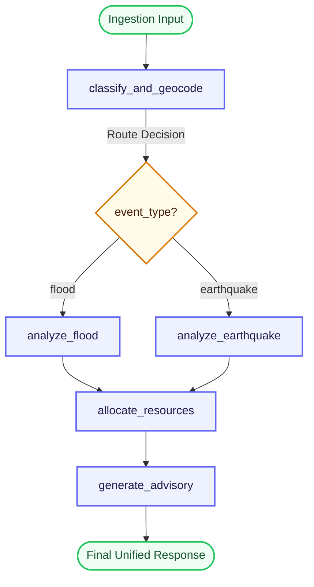

# AapdaSetu - Architecture Documentation

This document describes the architectural layout, principles, and design patterns utilized in **AapdaSetu**.

---

## 🏛️ Clean Architecture Layers

AapdaSetu adheres strictly to the principles of Clean Architecture. This guarantees that business logic (agents) is decoupled from delivery protocols (FastAPI endpoints) and resource sources (CSV data, HTTP API tools).

```text
┌─────────────────────────────────────────────────────────────┐
│                       FastAPI Web Layer                     │
│               (routes.py, main.py, schemas.py)              │
└──────────────────────────────┬──────────────────────────────┘
                               │ (Request Payload)
                               ▼
┌─────────────────────────────────────────────────────────────┐
│                    LangGraph AI Core Layer                  │
│                     (coordinator.py state)                  │
└──────────────┬───────────────┬───────────────┬──────────────┘
               │               │               │
               ▼               ▼               ▼
┌─────────────────────────────────────────────────────────────┐
│                         Agent Layer                         │
│   (flood_agent.py, earthquake_agent.py, resource_agent.py)  │
└──────────────┬───────────────┬───────────────┬──────────────┘
               │               │               │ (Tool Invocations)
               ▼               ▼               ▼
┌─────────────────────────────────────────────────────────────┐
│                          Tool Layer                         │
│   (weather_tool.py, maps_tool.py, rag_tool.py, etc.)        │
└──────────────┬───────────────┬───────────────┬──────────────┘
               │               │               │
               ▼               ▼               ▼
┌─────────────────────────────────────────────────────────────┐
│                        Resource Layer                       │
│    (Open-Meteo API, USGS Catalog, FAISS Vector DB, CSVs)    │
└─────────────────────────────────────────────────────────────┘
```

1. **FastAPI Web Layer**: Handles HTTP requests, deserializes JSON inputs into Pydantic models, manages life-cycle hooks (e.g., pre-caching models), and formats clean JSON responses.
2. **LangGraph AI Core Layer**: Manages the state machine. The state is a typed dict flow (`DisasterState`) that accumulates coordinates, severity scores, and relief assets node by node.
3. **Agent Layer**: Specialized modules running independent tasks. They call tools to gather ground truth, then run Gemini LLM prompts with precise contexts to extract reasoning.
4. **Tool Layer**: Standardized callable interfaces wrapping external services. They validate inputs, catch network timeouts, execute exponential retries, and return structured fallback data if the API is down.
5. **Resource Layer**: The ultimate data sources. Includes live REST APIs (USGS, Open-Meteo), a local high-performance vector index (FAISS), and structured files (hospitals/shelters CSVs).

---

## 🗺️ LangGraph Workflow State Machine

The orchestration graph uses directed edges, conditional routing, and deterministic convergence.



### Routing Logic
- **`classify_and_geocode`**: Geocodes address names using OSM Nominatim. If the disaster type is not pre-defined, it classifies the incident report text into `flood` or `earthquake` via a strict LLM classifier.
- **`route_disaster` (Conditional Edge)**: Evaluates the resolved `event_type` state variable and routes execution to either `analyze_flood` or `analyze_earthquake`.
- **`allocate_resources`**: Merges coordinates and severity to search local database records, calculating proximity using the Haversine formula and evacuation routing via OSRM.
- **`generate_advisory`**: Runs local vector similarity search against NDMA manuals to return a hallucination-free advice block.

---

## 📋 Architectural Best Practices
- **Strict Decoupling**: All tools are written as standalone Python functions that do not depend on LangGraph or LLMs. This makes them highly testable, allowing unit tests in `tests/test_tools.py` to run in isolation.
- **Robust Fallback Strategy**: APIs and external dependencies will inevitably fail, especially during live demonstrations. Our tools implement tenacity retries and fallback calculations (e.g., estimating route distance mathematically if OSRM is down, generating synthetic earthquake details if USGS has no recent events, and defaulting to structured monsoonal weather models if Open-Meteo is blocked).
- **Type Safety and Validation**: Every boundary utilizes Pydantic validation schemas (`backend/schemas.py`). Data loaded from local CSV files or received via POST requests is strictly parsed, validating coordinate boundaries and non-negative resource limits.
